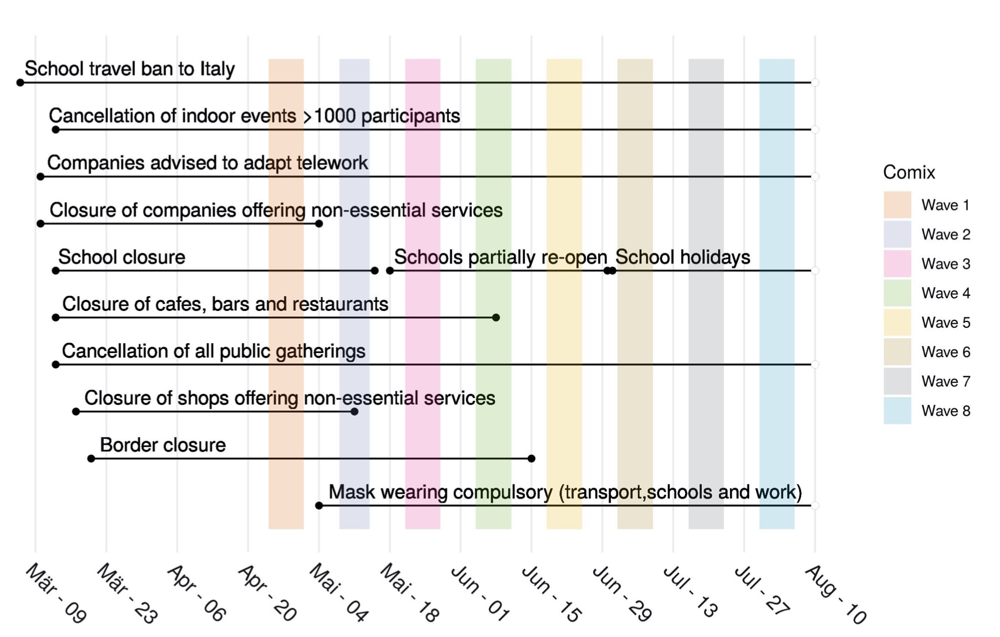

---
output:
  html_document: default
---
## Comparing mixing patterns during the COVID-19 pandemic (CoMix)

  
The CoMix project is initiated to measure compliance to social distancing during the COVID-19 pandemic and to assess the impact on disease transmission. Monitoring the effectiveness of social distancing recommendations is of paramount importance to avoid further waves of COVID-19.

Multiple survey waves were deployed in Belgium, The Netherlands and The United Kingdom since March, 2020. 
For now, we report only the Belgian survey and hope to include the others in the future.

## CoMix Belgium
Figure 1 provides an overview of the different waves in combination with the interventions in Belgium during the COVID-19 pandemic. 

<figure>
  
  <figcaption>Figure 1 - Calendar of interventions and CoMix data collection waves.</figcaption>
</figure>

  
During the first two waves (April & May 2020) of the survey, the reduction in the average number of contacts was around 80% and this was quite consistent across all age-classes. The average number of contacts increased over time, particularly for the younger age classes, still remaining significantly lower than pre-pandemic values. For more info, please see:

[Coletti P, Wambua J, Gimma A, Willem L, Vercruysse S, Vanhoutte B, Jarvis CI, van Zandvoort K, Edmunds J, Beutels P, Hens N. CoMix: comparing mixing patterns in the Belgian population during and after lockdown. medRxiv (2020).](https://www.medrxiv.org/content/10.1101/2020.08.06.20169763v1)

  
  
 
CoMix and SOCRATES are part of the [socialcontactdata.org](http://www.socialcontactdata.org) initiative and acknowledge funding from European Union’s Horizon 2020 Research and Innovation Programme: ERC grant TransMID (682540) and the EpiPose project (Epidemic intelligence to Minimize COVID-19's Public Health, Societal and Economical Impact).
 
